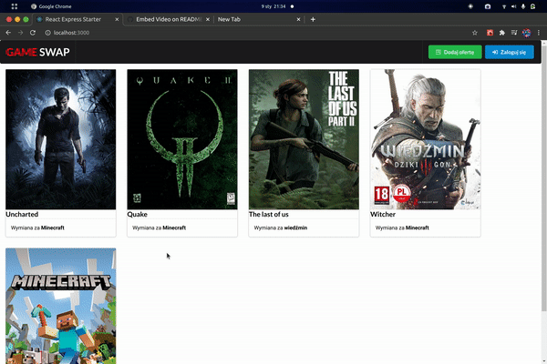
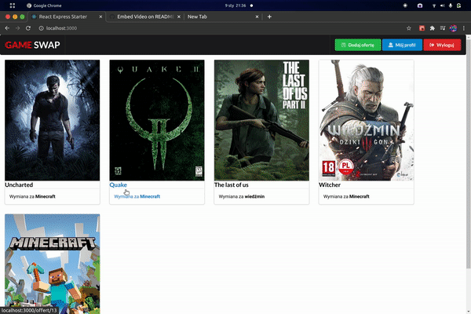
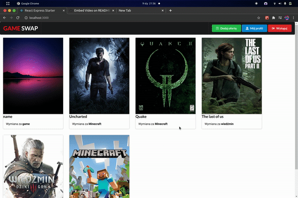

# Game Swap
[](https://www.repostatus.org/#suspended)
Game Swap is project of internet portal for exchanging games.
I have started this project in purpose to test my react skills after I learned its basics.
I was starting without any knowledge about back-end technologies but when project was getting bigger i needed backend. I chose express.js. This React and Express code may be a mess because it's my first that big project, But i'm happy with result for now:

## Warning!
Please do not use this project commercially without any changes for user auth. there is no security for it. I can't do it for now because I dont have that much knowledge
### How to run it
You need node.js version 12 or higher.
First setup MySql data base, you can find .sql file in project root directory and database config on top of the server.js file
When you have working MySql do these steps:
```sh
$ cd game-swap
$ npm install
$ cd client
$ npm install
$ cd ../
$ npm run dev
```
## Presentation
#### Login

#### Creating offer


#### Sign Up

#### Offer View


### Technologies
I used:
Semantic UI react - https://react.semantic-ui.com/
React Express starter - https://github.com/bradtraversy/react_express_starter
React JS - https://pl.reactjs.org/
Express JS - https://expressjs.com/
MySQL - https://www.mysql.com/
and other...

[](https://www.gnu.org/licenses/gpl-3.0)
[](https://www.repostatus.org/#concept)
[](https://www.repostatus.org/#suspended)

